# React.js Labs #
本專案使用 **creaet-react-app 3.2.0** 建立專案，提供可運作的開發環境，透過練習項目更了解 Javascript 與 ES 6 語法並且實際練習使用 React.js，以達到熟悉使用 React.js 開發之目的；此練習專案重點會放在 React.js 上面，對於 javascript 的語言特性與新版語法沒有太多著墨。文件最後會附上所有相關的參考資料連結，可依需要自行查閱。


[Online Lab Demo Here](https://yo-react-lab.herokuapp.com/ "Lab")

&nbsp;
## 行前準備 ##
1. 了解 **nvm** 為何？如何使用。
2. 了解 **npm** 為何？如何使用。
3. 具備**網頁**開發的基本知識(**HTML**、**CSS**、**Javascript**)。
4. 了解 **Javascript** 與 **ES 6** 語法。  
5. 了解 **git** 版本控管的原理與操作。
6. 了解 **react** 的 API 與生命周期。

&nbsp;
## 環境準備 ##
1. 安裝 **git**。
2. 安裝 **nvm**，管理 nodejs 版本。
3. 使用 nvm 安裝 **nodejs** ，nodejs 建議版本為 **10.16.0 以上**。
4. 安裝 **Visual Studio Code**。
5. Visual Studio Code 安裝擴充功能：**ESLint**、**Path Autocomplete**。
6. Chrome 安裝 **redux-devtools** ，用來 debug。 

&nbsp;

## 專案安裝 ##
* clone 此專案至本地端。
* 移除專案內的 .git 資料夾，並且在 bitbucket 新增一個私有的 repository，將程式碼簽入。  
* 在命令提示字元/終端機將目錄移至專案資料夾。
* 執行下列指令安裝 npm package 。  
```
npm install
```

&nbsp;

## 啟動 Mock Api 服務 ##
請使用 tp-react-lab-mock-api 專案作為 mock api 提供者。
```
npm start
```
**啟動成功後請不要關閉命令提示字元/終端機視窗，網站服務才能使用**  
練習項目時會使用到，於開發期間啟動此服務  
執行成功後開啟 http://localhost:8888/ ，畫面如下  
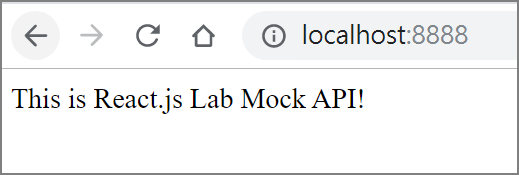  

&nbsp;

## 專案執行(開發) ##
```
npm run start
```
**啟動成功後請不要關閉命令提示字元/終端機視窗，網站才能使用**  
執行成功後開啟 http://localhost:3310/ ，畫面如下  
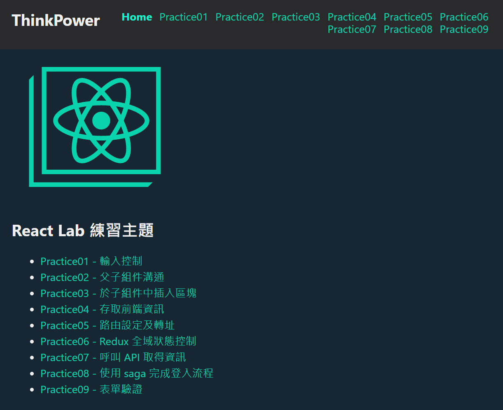  

&nbsp;

## 專案結構 ##
* **public/** – 靜態檔案資料夾，直接複製到打包後的資料夾  
* **src/assets/** – 程式使用到的 全域css、字型、圖片檔案  
* **src/components/** – 共用組件  
* **src/constants/** – 常數設定  
* **src/model/** – 定義全域狀態 redux, saga 位置，依功能做檔案區分   
* **src/services/** – 共用邏輯服務，例如：呼叫 API 的服務、共用(商業)邏輯  
* **src/setup/** – 全域 plugin 設定  
* **src/utils/** – 共用 helper 工具  
* **src/views/** – 功能頁面  
* **src/App.js** – 主組件  
* **src/index.js** – 程式進入點  

&nbsp;
## 練習項目01 - 輸入控制 ##
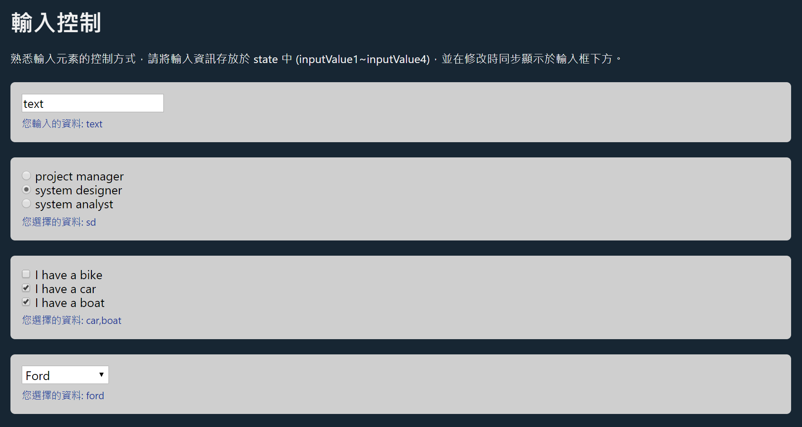  

&nbsp;
## 練習項目02 - 父子組件溝通 ##
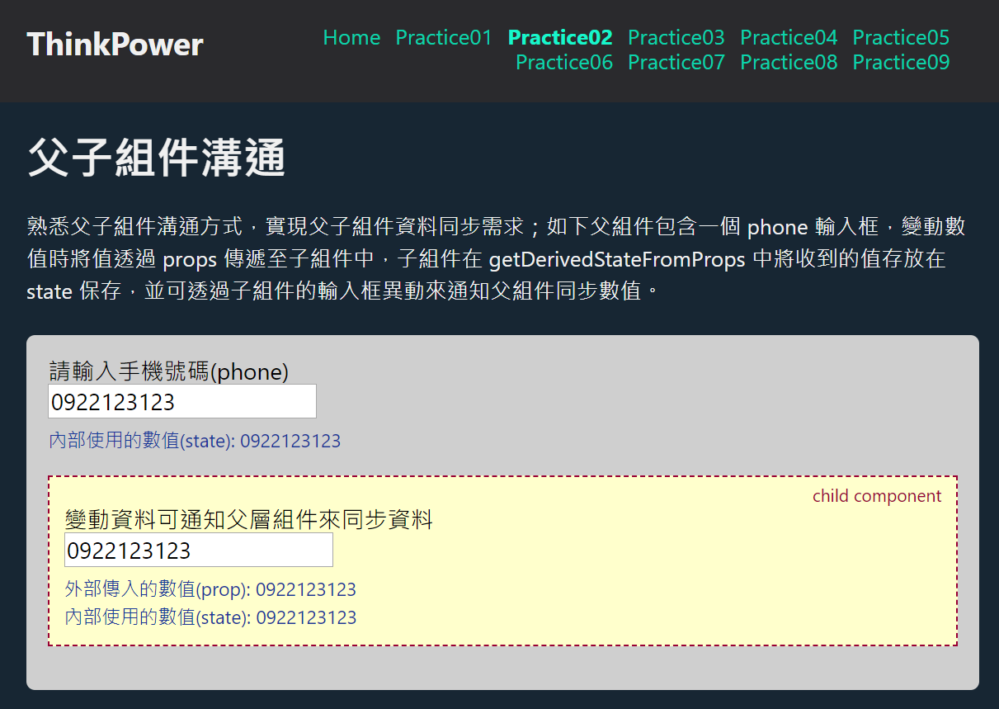  

&nbsp;
## 練習項目03 - 於子組件中插入區塊 ##
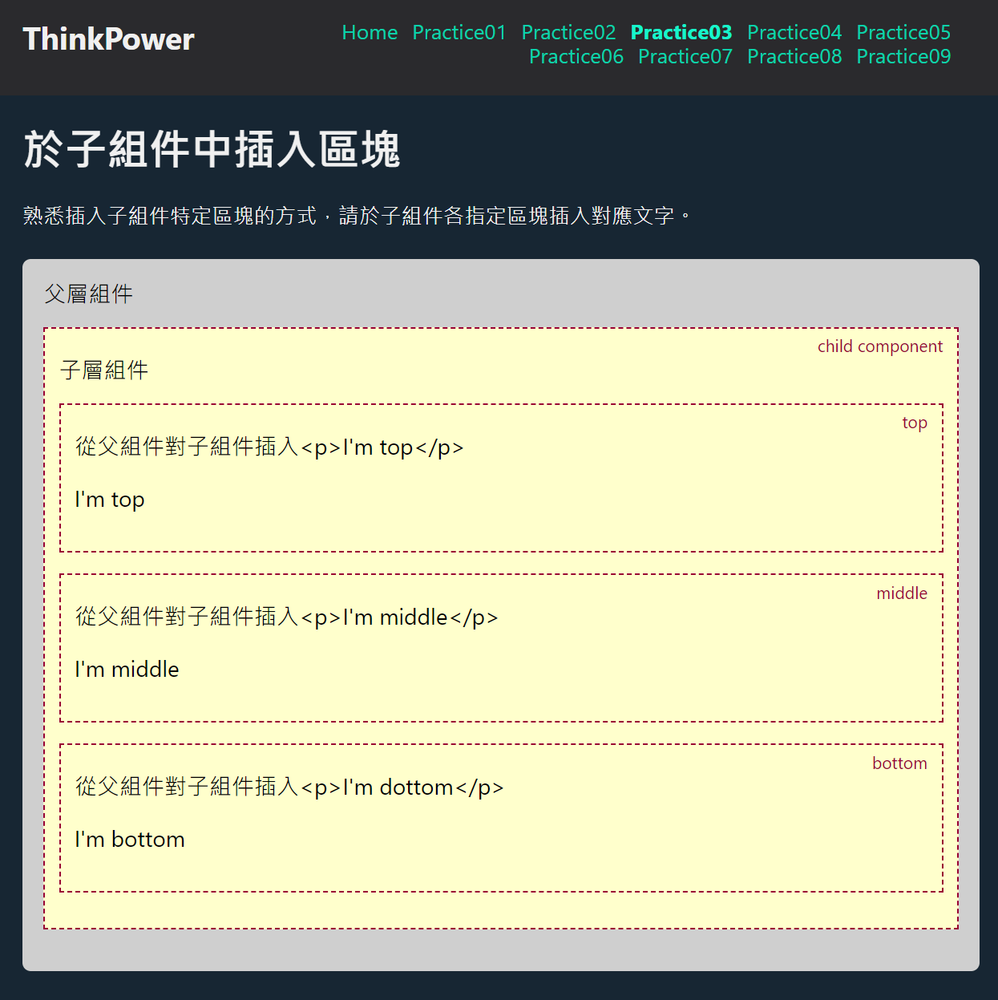  

&nbsp;
## 練習項目04 - 存取前端資訊 ##
  

&nbsp;
## 練習項目05 - 路由設定及轉址 ##
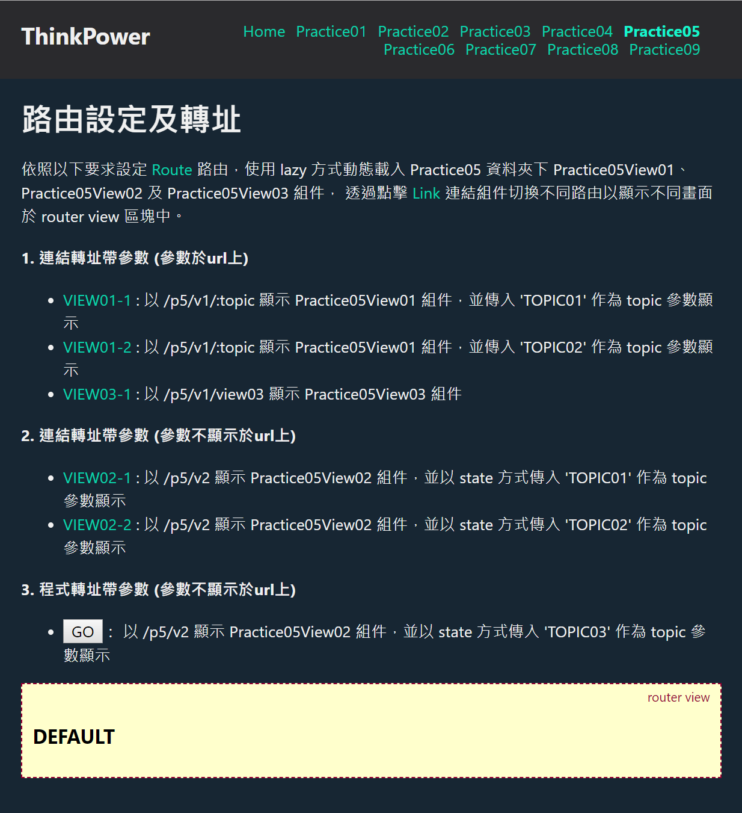  

&nbsp;
## 練習項目06 - Redux 全域狀態控制 ##
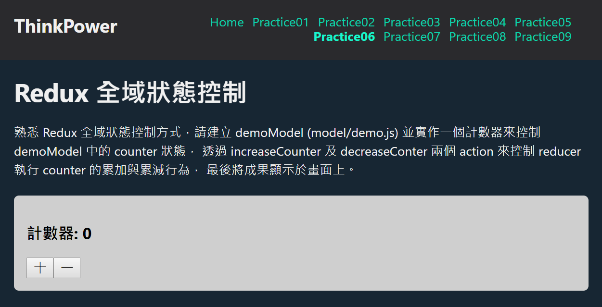  

&nbsp;
## 練習項目07 - 呼叫 API 取得資訊 ##
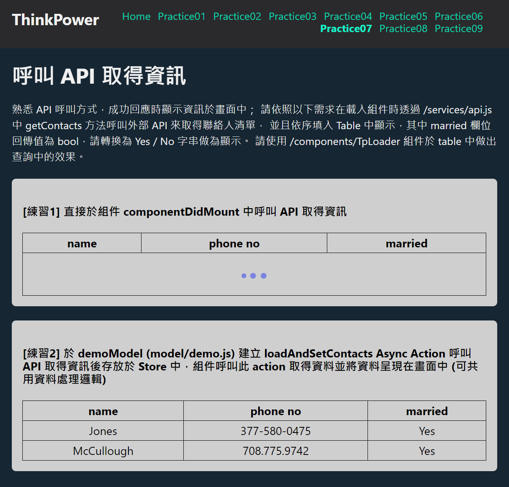  

&nbsp;
## 練習項目08 - 使用 saga 完成登入流程 ##
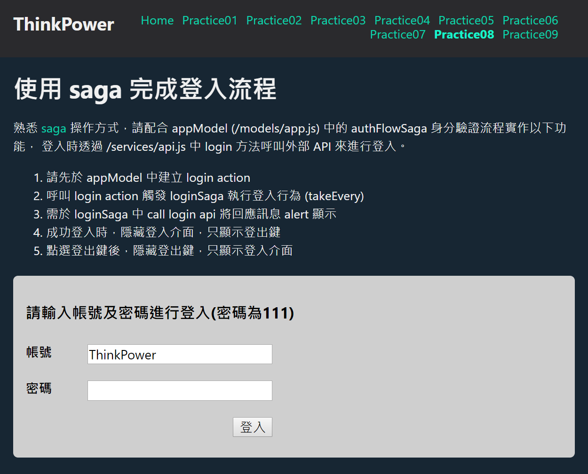  

&nbsp;
## 練習項目09 - 表單驗證 ##
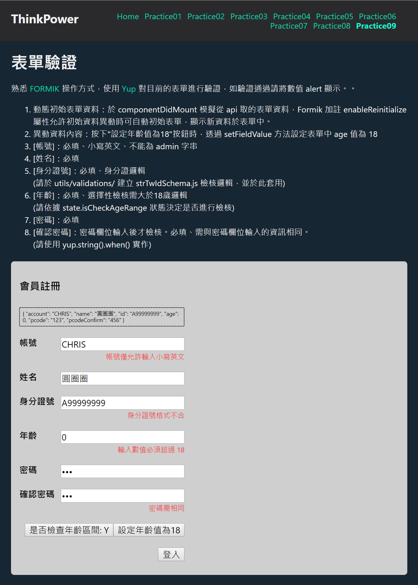  

&nbsp;
## 練習項目10 - 熟悉 Hook 操作方式 ##
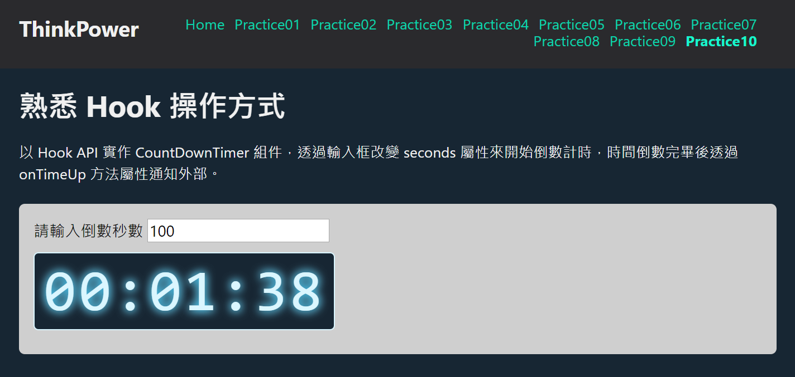  

&nbsp;
## 練習項目11 - 熟悉 styled-components 操作方式 ##
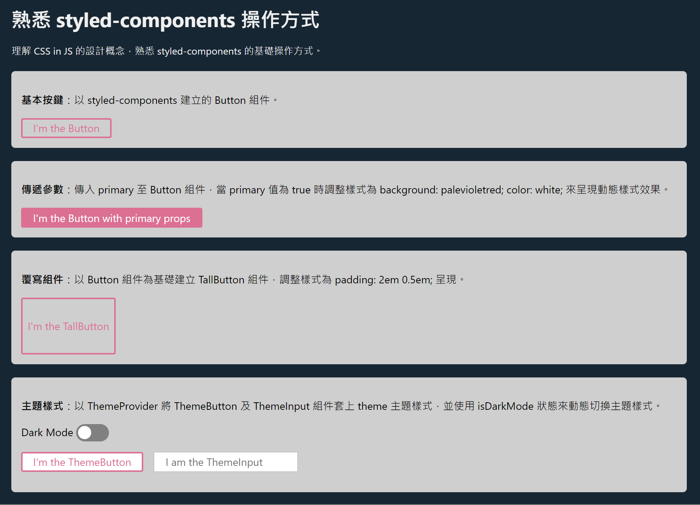  

&nbsp;
## 練習項目12 - 熟悉 Context 操作方式 ##
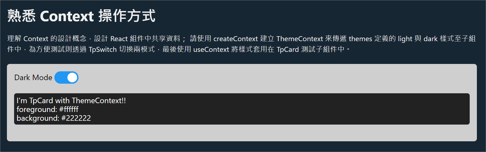  

&nbsp;
## 練習項目13 - 打造 Wizard 共用組件 ##
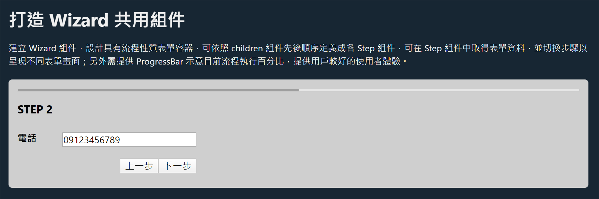  

&nbsp;
## 練習項目14 - 打造 Modal 共用組件 ##
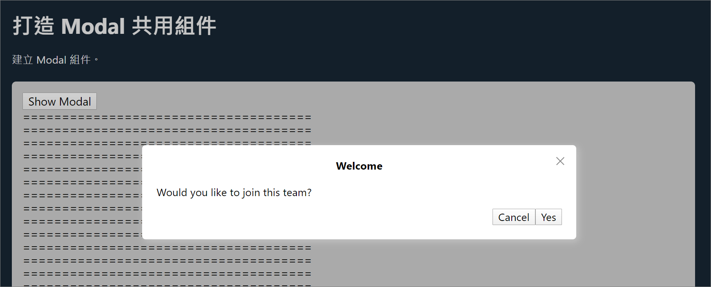  

&nbsp;
## 練習項目15 - 打造 Upload File 共用組件 ##
  

&nbsp;
## 練習項目16 - 打造 Tabs 共用組件 ##
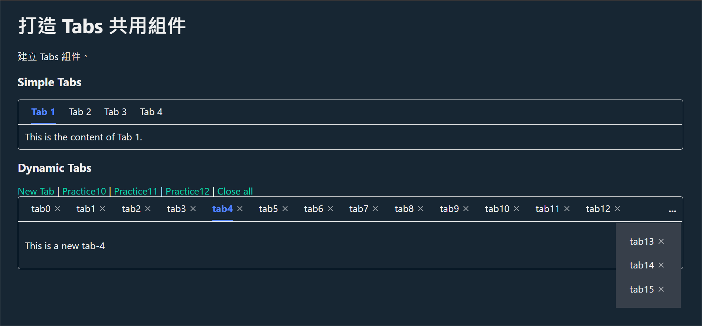  

&nbsp;
## 參考資料 ##
* 為你自己學 Git - https://gitbook.tw
* Bitbucket - https://bitbucket.org
* Visual Studio Code Tips and Tricks - https://code.visualstudio.com/docs/getstarted/tips-and-tricks  
* nvm for ios - https://github.com/creationix/nvm 
* nvm for windows: https://github.com/coreybutler/nvm-windows 
* npm - https://docs.npmjs.com
* ECMAScript 6 入門 - http://es6.ruanyifeng.com
* Sass - https://sass-lang.com
* axios - https://github.com/axios/axios  
* react - https://reactjs.org/
* react router - https://reacttraining.com/react-router/web/guides/quick-start
* redux - https://chentsulin.github.io/redux/
* redux saga - https://redux-saga.js.org/
* formik - https://jaredpalmer.com/formik/docs/overview
* yup - https://github.com/jquense/yup 
* Hook - https://en.reactjs.org/docs/hooks-intro.html
* useEffect 的完整指南 - https://overreacted.io/zh-hant/a-complete-guide-to-useeffect/