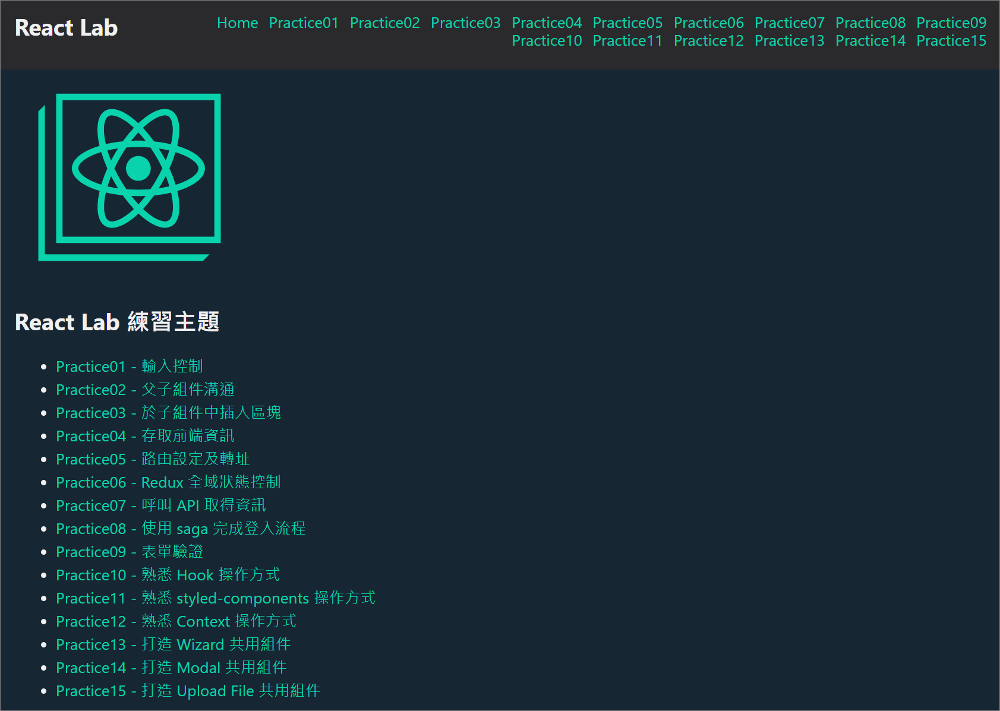

# Thinkpower - React.js Labs #
本專案使用 **creaet-react-app 3.2.0** 建立專案，提供可運作的開發環境，透過練習項目更了解 Javascript 與 ES 6 語法並且實際練習使用 React.js，以達到熟悉使用 React.js 開發之目的；此練習專案重點會放在 React.js 上面，對於 javascript 的語言特性與新版語法沒有太多著墨。文件最後會附上所有相關的參考資料連結，可依需要自行查閱。

***
## 行前準備 ##
1. 了解 **nvm** 為何？如何使用。
2. 了解 **npm** 為何？如何使用。
3. 具備**網頁**開發的基本知識(**HTML**、**CSS**、**Javascript**)。
4. 了解 **Javascript** 與 **ES 6** 語法。  
5. 了解 **git** 版本控管的原理與操作。
6. 了解 **react** 的 API 與生命周期。

***
## 環境準備 ##
1. 安裝 **git**。
2. 安裝 **nvm**，管理 nodejs 版本。
3. 使用 nvm 安裝 **nodejs** ，nodejs 建議版本為 **10.16.0 以上**。
4. 安裝 **Visual Studio Code**。
5. Visual Studio Code 安裝擴充功能：**ESLint**、**Path Autocomplete**。
6. Chrome 安裝 **redux-devtools** ，用來 debug。 

***
## 專案安裝 ##
* clone 此專案至本地端。
* 在命令提示字元/終端機將目錄移至專案資料夾。
* 執行下列指令安裝 npm package 。  
```
npm install
```
* 移除專案內的 .git 資料夾，並且在 bitbucket 新增一個私有的 repository，將程式碼簽入。  

***
## 啟動 Mock Api 服務 ##
```
npm run start-mock
```
**啟動成功後請不要關閉命令提示字元/終端機視窗，網站服務才能使用**  
練習項目時會使用到，於開發期間啟動此服務  
執行成功後開啟 http://localhost:9999/ ，畫面如下  
  

***
## 專案執行(開發) ##
```
npm run start
```
**啟動成功後請不要關閉命令提示字元/終端機視窗，網站才能使用**  
執行成功後開啟 http://localhost:3310/ ，畫面如下  
  

***
## 專案結構 ##
* **public/** – 靜態檔案資料夾，直接複製到打包後的資料夾  
* **src/assets/** – 程式使用到的 全域css、字型、圖片檔案  
* **src/components/** – 共用組件  
* **src/constants/** – 常數設定  
* **src/model/** – 定義全域狀態 redux, saga 位置，依功能做檔案區分   
* **src/services/** – 共用邏輯服務，例如：呼叫 API 的服務、共用(商業)邏輯  
* **src/setup/** – 全域 plugin 設定  
* **src/utils/** – 共用 helper 工具  
* **src/views/** – 功能頁面  
* **src/App.js** – 主組件  
* **src/index.js** – 程式進入點  

***
## 參考資料 ##
* 為你自己學 Git - https://gitbook.tw
* Bitbucket - https://bitbucket.org
* Visual Studio Code Tips and Tricks - https://code.visualstudio.com/docs/getstarted/tips-and-tricks  
* nvm for ios - https://github.com/creationix/nvm 
* nvm for windows: https://github.com/coreybutler/nvm-windows 
* npm - https://docs.npmjs.com
* ECMAScript 6 入門 - http://es6.ruanyifeng.com
* Sass - https://sass-lang.com
* axios - https://github.com/axios/axios  
